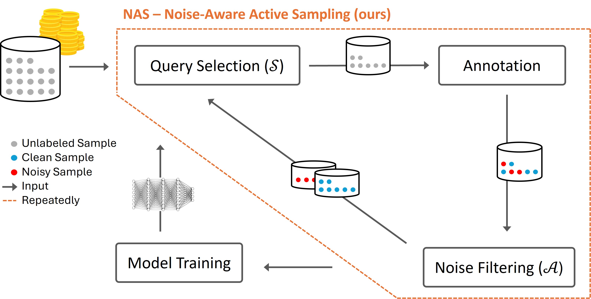

# Active Learning with a Noisy Annotator

This repository contains the official code implementation for the paper:  
**"Active Learning with a Noisy Annotator"** [[arXiv](https://arxiv.org/abs/2504.04506)].

## Overview

Active Learning (AL) is a powerful approach to reduce labeling costs by selecting the most informative examples for annotation. However, in real-world settings, annotators may introduce **label noise**, which can significantly harm AL performance — especially in the **low-budget regime**.

This project presents **Noise-Aware Active Sampling (NAS)** — a novel meta-algorithm that enhances coverage-based AL strategies to make them more robust to noisy labels. NAS integrates a lightweight noise-filtering step into the AL loop to identify and avoid mislabeled regions.

<center>
  <p>
    
  </p>
  <p>
    <em><strong>Noise-Aware Active Sampling (NAS):</strong>  
    A visual overview of our NAS framework. NAS (illustrated by the dashed orange line) takes as input a query selection strategy 𝒮 and a noise-filtering algorithm 𝒜. It alternates between selecting 𝑏 samples using 𝒮, sending them for annotation, and filtering noisy samples with 𝒜 before proceeding to the next round.
    </em>
  </p>
</center>

## Repository Structure (partial)

```
.
deep-al/
|    ├── configs/                 # YAML config files for different experiments
|    ├── pycls/                 
|    │   ├── datasets/            # Includes classes for all the datasets supported in this repo.
|    │   │   └── utils/
|    │   │       └── features.py  # Mapping for SSL embeddings for each dataset
|    │   ├── al/                  # Active Learning strategies (query selection methods)
|    │   └── lnl/                 # Learning with Noisy Labels (LNL) methods
|    ├── tools/                
|    │   └── train_al.py          # Main training + active learning loop
└── README.md                     # This file
```

## Setup

### Installation

```bash
git clone https://github.com/nettashafir/active_learning_with_label_noise.git
cd active_learning_with_label_noise
pip install -r requirements.txt
```

### Pretrained Features

Typicality-based or Representation-based strategies (like ProbCover, MaxHerding, and their NAS-enhanced versions) require **self-supervised learning (SSL) features** (e.g., SimCLR, DINOv2). These features should be stored as PyTorch tensors or NumPy arrays of shape `(N, d)`, where `N` is the number of samples and `d` is the embedding dimension.

Feature file paths are mapped in:  `deep-al/pycls/datasets/utils/features.py`

To train SSL features, you can use popular libraries such as [SCAN](https://github.com/wvangansbeke/Unsupervised-Classification) or [solo-learn](https://github.com/vturrisi/solo-learn).

## Usage

Run **NPC (ProbCover+NAS)** query selection strategy with **LowBudgetAUM** noise filter on CIFAR100 with 50% symmetric noise, using a ResNet18:

```bash
cd deep-al/tools
python train_al.py --cfg ../configs/cifar100/al/RESNET18.yaml \
                   --al npc \              # query selection algorithm
                   --initial_delta 0.65 \  # ProbCover's delta hyperparameter
                   --initial_size 0 \      # Initial randomly selected labeled set
                   --budget 100 \          # budget for each round
                   --num_episodes 5 \      # number of active learning rounds
                   --noise_type sym \ 
                   --noise_rate 0.5 \
                   --lnl aum               # noise filtering algorithm
```

Or equivalently using `samples_per_class`:
```bash
python train_al.py --cfg ../configs/cifar100/al/RESNET18.yaml \
                   --al npc \
                   --initial_delta 0.65 \
                   --initial_size 0 \
                   --samples_per_class 1 2 3 4 5 \
                   --noise_type sym \
                   --noise_rate 0.5 \
                   --lnl aum
```

Another example: Run **MaxHerding+NAS** query selection strategy with **CrossValidation** noise filter on Clothing1M (real-world noisy dataset with ~38% noise), using linear probing over SSL features:

```bash
cd deep-al/tools
python train_al.py --cfg ../configs/clothing1m/al/RESNET18.yaml \
                   --al maxherding_nas \
                   --initial_delta 0.3 \
                   --initial_size 0 \
                   --samples_per_class 1 2 3 4 5 \
                   --lnl cv \
                   --use_linear_model
```

You can control most settings either via the config files or by passing them as arguments to `train_al.py`.

## Citation

If you use this code, please cite our work:

```bibtex
@article{shafir2025active,
  title={Active Learning with a Noisy Annotator},
  author={Shafir, Netta and Hacohen, Guy and Weinshall, Daphna},
  journal={arXiv preprint arXiv:2504.04506},
  year={2025}
}
```

## Acknowledgments

This project builds on [Deep-AL](https://github.com/acl21/deep-active-learning-pytorch).  
We also use official implementations from:
- [Typiclust, ProbCover, and DCoM](https://github.com/avihu111/TypiClust/tree/main)
- [MaxHerding](https://github.com/BorealisAI/uherding)
- [DIRECT](https://github.com/EfficientTraining/LabelBench/blob/main/LabelBench/strategy/strategy_impl/direct.py)

## Contact

Feel free to open an issue or reach out to `netta.shafir@mail.huji.ac.il` with any questions!
